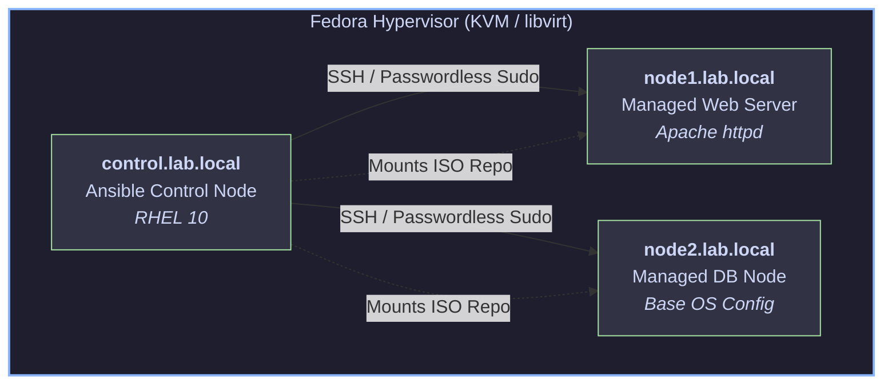

# Enterprise RHEL 10 Infrastructure Automation with Ansible
[](https://www.redhat.com/en/technologies/linux-platforms/enterprise-linux)
[](https://www.ansible.com/)
[](https://www.linux-kvm.org/)
[](https://opensource.org/licenses/MIT)

An enterprise-grade, multi-node Linux lab deployed on native KVM/`libvirt` virtualized infrastructure, automated end-to-end using Ansible core. 

Designed to demonstrate production-ready configuration management, idempotent playbook design, local repository management, and Linux systems administration.

---

## 🏗️ Architecture & Lab Topology



The lab consists of three persistent Red Hat Enterprise Linux 10 virtual machines hosted on a Fedora KVM/`libvirt` hypervisor:

| Hostname | Role | IP Address / FQDN | OS | Services / Modules Managed |
| :--- | :--- | :--- | :--- | :--- |
| **`control`** | Ansible Control Node | `control.lab.local` | RHEL 10 | Ansible Core, OpenSSH, Git |
| **`node1`** | Managed Web Server | `node1.lab.local` | RHEL 10 | `common`, `webserver` (Apache `httpd`, `firewalld`, Jinja2 |
| **`node2`** | Managed Database Node | `node2.lab.local` | RHEL 10 | common (`chronyd`, system utilities), Local DNF Repo |

### Infrastructure Highlights
* **Virtualization:** Native KVM / `libvirt` managed via `virt-manager` and `virsh`.
* **Security & Access:** Key-based SSH authentication (`ed25519`), passwordless `sudo` privileges for the `ansible` automation account.
* **Package Management:** Custom local BaseOS and AppStream DNF repositories mounted via ISO image (`setup_repo.yml`).

---

## 🛠️ Repository Structure

```text

.
├── ansible.cfg          # Custom Ansible configuration (inventory path, privilege escalation)
├── group_vars/          # Global and host-group variable overrides
│   ├── all.yml          # Environment-wide variables
│   └── webservers.yml   # Webserver group variable overrides
├── inventory            # Static INI inventory defining node groups ([webservers], [dbservers])
├── roles/               # Production-grade Ansible roles
│   ├── common/          # Baseline configuration applied to all managed nodes
│   │   └── tasks/
│   │       └── main.yml
│   └── webserver/       # Modular web application stack role
│       ├── defaults/
│       │   └── main.yml # Default role variable fallbacks
│       ├── handlers/
│       │   └── main.yml # Event-driven Apache restart handler
│       ├── tasks/
│       │   └── main.yml # Role task sequence
│       └── templates/
│           └── index.html.j2 # Dynamic Jinja2 web page template
├── setup_repo.yml       # Local DNF ISO repository deployment playbook
├── site.yml             # Master orchestration playbook executing roles across inventory
└── .gitignore           # Git rule file excluding runtime artifacts and credentials

```
---

## 🚀 Quick Start & Usage

### Prerequisites
* RHEL 10 managed nodes with SSH public key distribution completed.
* Ansible installed on the control node.

### Execution
1. **Verify connectivity across all nodes:**
```bash
ansible all -m ping
```
2. **Bootstrap local BaseOS/AppStream package repositories:**
```bash
ansible-playbook setup_repo.yml
```
3. **Run master orchestration playbook across all roles:**
```bash
ansible-playbook site.yml
```
4. **Verify dynamic deployment:** 
```bash
curl http://node1
```
---

## 📜 Key Engineering Practices Demonstrated:

* **Modular Role Architecture:** Refactored monolithic playbooks into standardized Ansible roles (`common`, `webserver`), encapsulating tasks, variables, handlers, and templates into clean directory scopes.

* **Variable Precedence & Decoupling:** Leveraged role `defaults/main.yml` alongside `group_vars/` to provide robust default configuration fallbaks while allowing clean environment-level overrides.

* **Implicit Template & Handler Scoping:** Automated task handling by utilizing Ansible's implicit lookup for templates (`roles/webserver/templates/`) and handlers (`roles/webserver/handlers/`).

* **Idempotency & Even-Driven Execution:** Guranteed deterministic state management where services (e.g., `httpd`) are only restarted via `notify` when configuration templates change.

* **Air-Gapped Infrastructure Management:** Isolated repository management (`setup_repo.yml`) handling offline Enterprise Linux package installation via loop-mounted ISOs.

