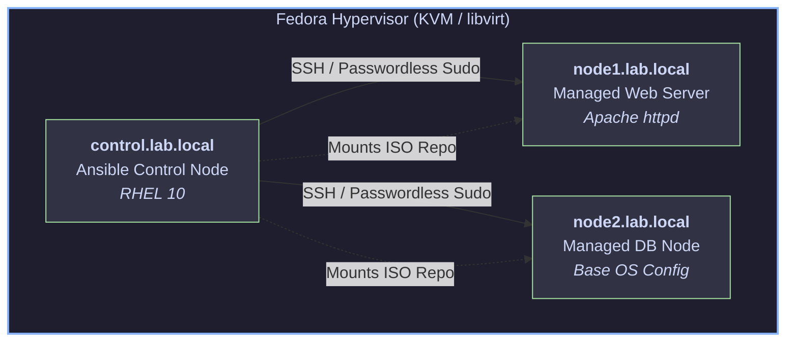

# Enterprise RHEL 10 Infrastructure Automation with Ansible
[](https://www.redhat.com/en/technologies/linux-platforms/enterprise-linux)
[](https://www.ansible.com/)
[](https://www.linux-kvm.org/)
[](https://opensource.org/licenses/MIT)

An enterprise-grade, multi-node Linux lab deployed on native KVM/`libvirt` virtualized infrastructure, automated end-to-end using Ansible core. 

Designed to demonstrate production-ready configuration management, idempotent playbook design, local repository management, and Linux systems administration.

---

## 🏗️ Architecture & Lab Topology



The lab consists of three persistent Red Hat Enterprise Linux 10 virtual machines hosted on a Fedora KVM/`libvirt` hypervisor:

| Hostname | Role | IP Address / FQDN | OS | Services / Modules Managed |
| :--- | :--- | :--- | :--- | :--- |
| **`control`** | Ansible Control Node | `control.lab.local` | RHEL 10 | Ansible Core, OpenSSH, Git |
| **`node1`** | Managed Web Server | `node1.lab.local` | RHEL 10 | Apache (`httpd`), `firewalld`, Local DNF Repo |
| **`node2`** | Managed Database Node | `node2.lab.local` | RHEL 10 | Base System Config, Local DNF Repo |

### Infrastructure Highlights
* **Virtualization:** Native KVM / `libvirt` managed via `virt-manager` and `virsh`.
* **Security & Access:** Key-based SSH authentication (`ed25519`), passwordless `sudo` privileges for the `ansible` automation account.
* **Package Management:** Custom local BaseOS and AppStream DNF repositories mounted via ISO image (`ansible.posix.mount` and `ansible.builtin.yum_repository`).

---

## 🛠️ Repository Structure

```text
.
├── ansible.cfg          # Custom Ansible configuration (inventory path, privilege escalation)
├── inventory            # Static INI inventory defining node groups ([webservers], [dbservers])
├── site.yml             # Primary site orchestration playbook
├── setup_repo.yml       # Local DNF ISO repository deployment playbook
└── .gitignore           # Git rule file excluding runtime artifacts and credentials

```
---

## 🚀 Quick Start & Usage

### Prerequisites
* RHEL 10 managed nodes with SSH public key distribution completed.
* Ansible installed on the control node.

### Execution
1. **Verify connectivity across all nodes:**
```bash
ansible all -m ping
```
2. **Deploy local BaseOS/AppStream package repositories:**
```bash
ansible-playbook setup_repo.yml
```
3. **Execute baseline configuration and web service deployment:**
```bash
ansible-playbook site.yml
```
4. **Verify deployment:** 
```bash
curl http://node1
```
---

## 📜 Key Engineering Practices Demonstrated:

* **Idempotency:** Playbooks ensure consistent system state across re-runs without unnecessary side effects or service interruptions.

* **Modular Repository Design:** Local ISO mounting strategy handling offline/air-gapped Enterprise Linux environments.

* **Version Control Cleanliness:** Strict exclusion of keys, temporary artifacts, and runtime cache files via .gitignore.
